

  <picture>
    <source media="(prefers-color-scheme: dark)" srcset="assets/character-sheet-night.svg" />
    
  </picture>

<!-- items:start -->

  <picture><source media="(prefers-color-scheme: dark)" srcset="assets/header-crafted-items-night.svg" /></picture>

  <a href="https://github.com/Yuuzulight/Mana"><picture><source media="(prefers-color-scheme: dark)" srcset="assets/item-mana-night.svg" />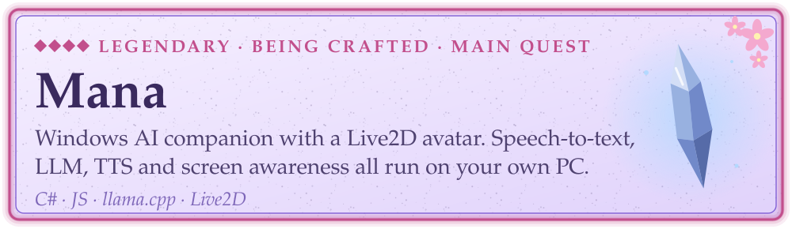</picture></a>

  <a href="https://github.com/Yuuzulight/Hecate"><picture><source media="(prefers-color-scheme: dark)" srcset="assets/item-hecate-night.svg" />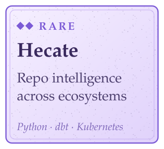</picture></a>
  <a href="https://github.com/Yuuzulight/Folio"><picture><source media="(prefers-color-scheme: dark)" srcset="assets/item-folio-night.svg" />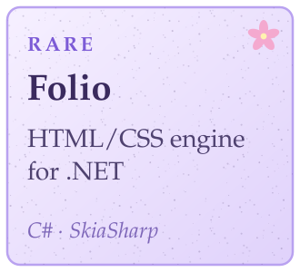</picture></a>
  <a href="https://github.com/Yuuzulight/Hephastion"><picture><source media="(prefers-color-scheme: dark)" srcset="assets/item-hephastion-night.svg" />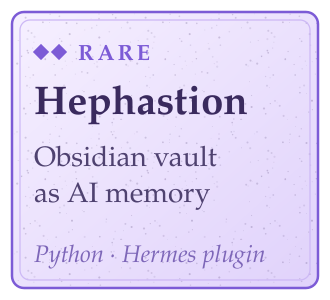</picture></a>

  <a href="https://github.com/Yuuzulight/Argos"><picture><source media="(prefers-color-scheme: dark)" srcset="assets/item-argos-night.svg" />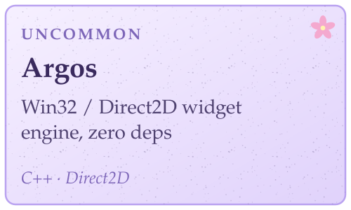</picture></a>
  <a href="https://github.com/Yuuzulight/Veritarach"><picture><source media="(prefers-color-scheme: dark)" srcset="assets/item-veritarach-night.svg" />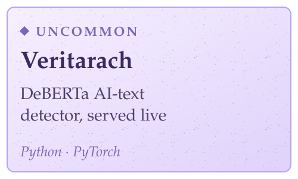</picture></a>

  <a href="https://github.com/Yuuzulight/Rozetta"><picture><source media="(prefers-color-scheme: dark)" srcset="assets/item-rozetta-night.svg" />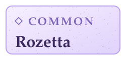</picture></a>
  <a href="https://github.com/Yuuzulight/Veracia"><picture><source media="(prefers-color-scheme: dark)" srcset="assets/item-veracia-night.svg" />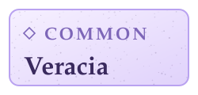</picture></a>
  <a href="https://github.com/Yuuzulight/Wisp"><picture><source media="(prefers-color-scheme: dark)" srcset="assets/item-wisp-night.svg" />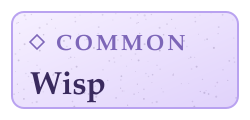</picture></a>
  <a href="https://github.com/Yuuzulight/db-artisan"><picture><source media="(prefers-color-scheme: dark)" srcset="assets/item-db-artisan-night.svg" />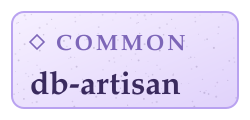</picture></a>

  <picture><source media="(prefers-color-scheme: dark)" srcset="assets/header-quest-board-night.svg" /></picture>

  <a href="https://github.com/Yuuzulight/Mana/blob/main/docs/quick_start_windows.md"><picture><source media="(prefers-color-scheme: dark)" srcset="assets/quest-1-night.svg" />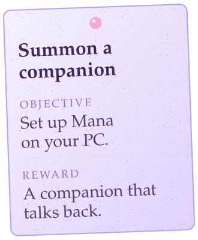</picture></a>
  <a href="https://github.com/Yuuzulight?tab=repositories"><picture><source media="(prefers-color-scheme: dark)" srcset="assets/quest-2-night.svg" />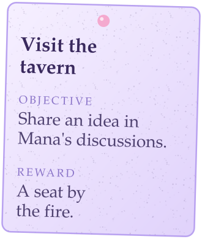</picture></a>
  <a href="https://yuuzulight.github.io"><picture><source media="(prefers-color-scheme: dark)" srcset="assets/quest-3-night.svg" />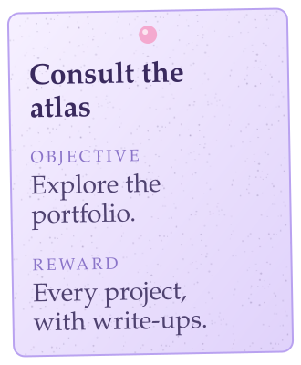</picture></a>

  <picture><source media="(prefers-color-scheme: dark)" srcset="assets/header-equipment-night.svg" /></picture>

  <picture><source media="(prefers-color-scheme: dark)" srcset="assets/equipment-night.svg" />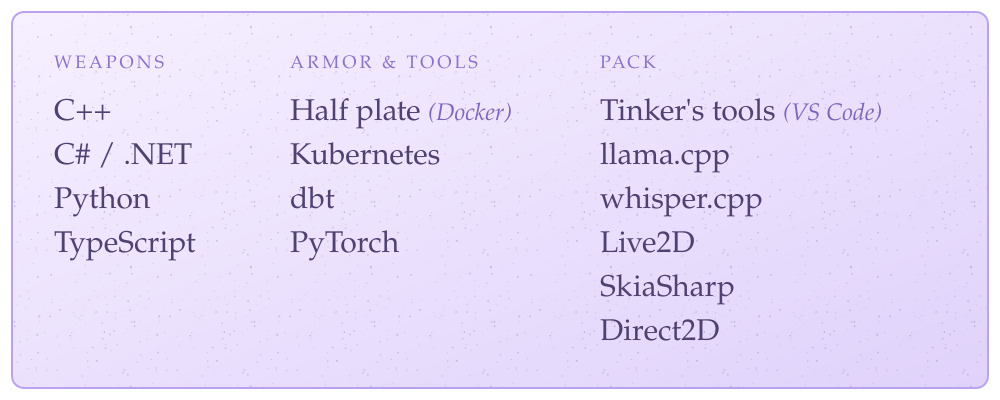</picture>

<!-- items:end -->

✦ Pull up a seat by the fire. Thanks for stopping by, adventurer. ✦

