  

#### Companion infusions · local-first AI

<table>
<tr>
<td valign="top" width="50%">
<b><a href="https://github.com/Yuuzulight/Mana">Mana</a></b> · C# / JS 
Windows AI companion with a Live2D avatar. Speech-to-text, LLM, TTS and screen awareness all run locally.
</td>
<td valign="top" width="50%">
<b><a href="https://github.com/Yuuzulight/Wisp">Wisp</a></b> · Python 
Answer engine on SearXNG. Reranks, extracts and writes cited answers, with no index or cache.
</td>
</tr>
<tr>
<td valign="top">
<b><a href="https://github.com/Yuuzulight/Hephastion">Hephastion</a></b> · Python 
Uses an Obsidian vault as long-term memory for Hermes Desktop.
</td>
<td valign="top">
<b><a href="https://github.com/Yuuzulight/Rozetta">Rozetta</a></b> · Python 
MCP server exposing YouTube transcripts and stats as tools.
</td>
</tr>
</table>

#### Forged tools · native Windows

<table>
<tr>
<td valign="top" width="50%">
<b><a href="https://github.com/Yuuzulight/Argos">Argos</a></b> · C++ 
Rainmeter-style widget engine in C++17 / Win32 / Direct2D, with no third-party dependencies.
</td>
<td valign="top" width="50%">
<b><a href="https://github.com/Yuuzulight/Folio">Folio</a></b> · C# 
Lightweight HTML/CSS rendering engine for .NET, drawn natively with SkiaSharp.
</td>
</tr>
</table>

#### Scrying instruments · data & ML

<table>
<tr>
<td valign="top" width="50%">
<b><a href="https://github.com/Yuuzulight/Hecate">Hecate</a></b> · Python 
Repository intelligence: multi-source ETL over GitHub, npm, PyPI and GitLab, with dbt on Kubernetes.
</td>
<td valign="top" width="50%">
<b><a href="https://github.com/Yuuzulight/Veritarach">Veritarach</a></b> · Python 
Fine-tuned DeBERTa AI-text detector, served as a live inference service.
</td>
</tr>
<tr>
<td valign="top">
<b><a href="https://github.com/Yuuzulight/Veracia">Veracia</a></b> · Python 
Shared evaluation harness that checks whether an ML output can be trusted.
</td>
<td valign="top">
<b><a href="https://github.com/Yuuzulight/db-artisan">db-artisan</a></b> · agent skills 
Agent skills for designing database schemas and data pipelines.
</td>
</tr>
</table>

<table>
<tr>
<td valign="top" width="33%">
<b>Summon a companion</b> 
Set up Mana on your own Windows PC with the <a href="https://github.com/Yuuzulight/Mana/blob/main/docs/quick_start_windows.md">quick start</a>.
</td>
<td valign="top" width="33%">
<b>Visit the tavern</b> 
Bring ideas and questions to <a href="https://github.com/Yuuzulight/Mana/discussions">Mana's discussions</a>.
</td>
<td valign="top" width="33%">
<b>Consult the atlas</b> 
Every project, with write-ups, at <a href="https://yuuzulight.github.io">yuuzulight.github.io</a>.
</td>
</tr>
</table>

  
   
  

✦ Long rest taken. Thanks for stopping by, adventurer. ✦

